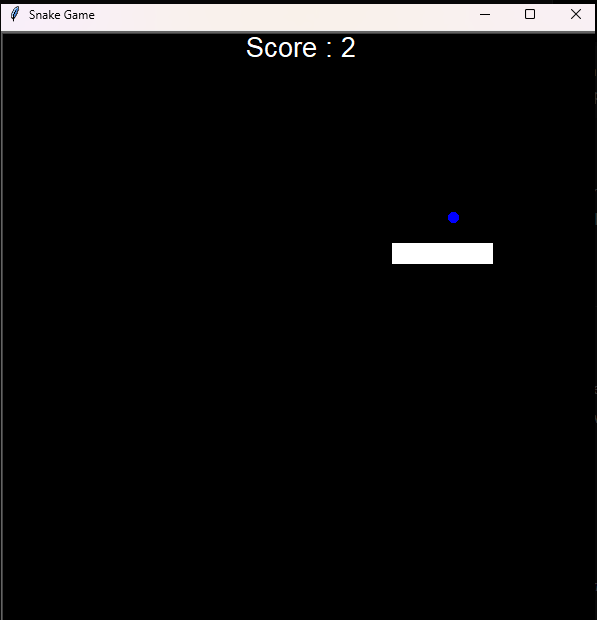
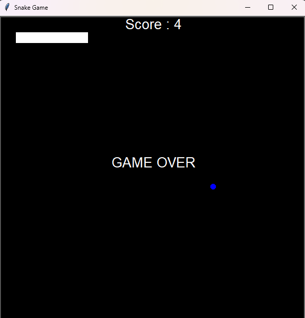

## 🐍 Snake Game

A simple Snake Game built using Python's turtle graphics library.
The objective is to eat the food (blue dot) and grow the snake. The game ends when the snake collides with the wall or itself.

## 🎮 Game Preview
**Gameplay**  
  

**Game Over Screen**  
  

## 🚀 Features
- Classic Snake gameplay  
- Score tracking  
- Game Over screen  
- Simple and smooth controls

## 🛠️ Tech Stack
- Language: Python 🐍
- Library: turtle (built-in with Python)

## 🎯 Controls
- ⬆️ Up Arrow – Move Up
- ⬇️ Down Arrow – Move Down
- ⬅️ Left Arrow – Move Left
- ➡️ Right Arrow – Move Right

## 📌 Future Improvements
- Add difficulty levels
- Add restart button
- Add sound effects
